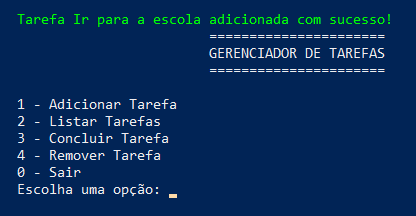

# **GerenciadorDeTarefas**

## O que é?
Um gerenciador de tarefas ajuda a organizar, acompanhar e gerenciar atividades, prazos e responsabilidades, permitindo que indivíduos ou equipes tenham uma visão clara de suas demandas e prioridades. Com ele, é possível distribuir melhor o tempo, evitar esquecimentos, garantir o cumprimento de prazos e otimizar o fluxo de trabalho. Além disso, essa ferramenta contribui para a coordenação eficiente de múltiplas tarefas simultaneamente, facilitando o planejamento e a execução de projetos de maneira mais estruturada e produtiva.

# O gerenciador de tarefas:

### Menu

### Função adicionar tarefa

### Função adicionar tarefa (menu)

### Função listar tarefas

### Função concluir tarefas

### Função concluir tarefas (menu)

### Função remover tarefas

### Função remover tarefas (menu)

### Função sair
